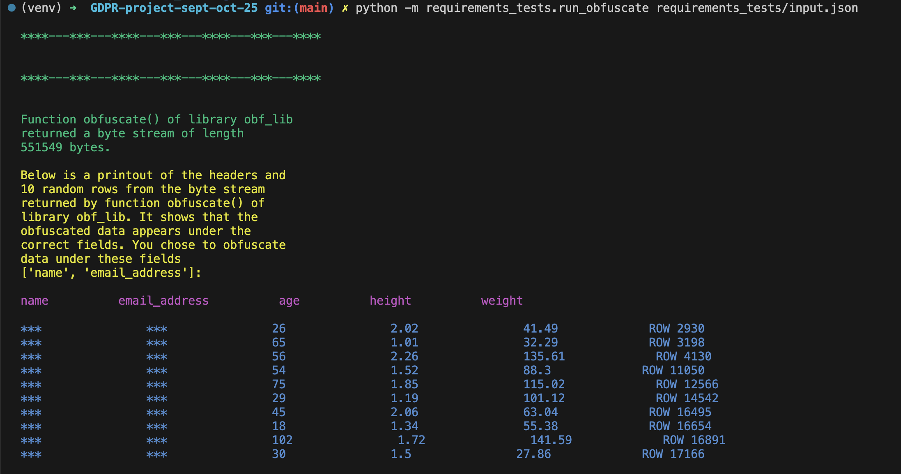

## Project title 

# GDPR-compliant obfuscation of PII data  
<br>
<br>
<br>


## Description <br>
This project 
 - creates Python library obf_lib that will search through a .csv file at a given path for personally identifiable information (PII) stored under given fields 
 - obfuscate that data 
 - return the changed contents of the file in the form of a byte stream. <br> <br> <br>
The calling procedure will supply library obf_lib with a json string that takes a form similar to this:  <br>
```
"""
{
	"file_to_obfuscate": "s3://my_ingestion_bucket/new_data/file1.csv", 
	"pii_fields": ["<some header>", "<some other header>", etc]
}
""" 
```
<br> <br>
The value of key "file_to_obfuscate" in the json string above is a string of the kind recognised by Python third-party library boto3 and represents a path to a file that contains data to be obfuscated. The file resides in an Amazon Web Services (AWS) S3 bucket. This is a breakdown of the parts of the string: <br>

 - __'my_ingestion_bucket'__ is the name of the S3 bucket <br>
 - __'new_data/file1.csv'__ is the name of the key under which the S3 bucket stores the file <br>
 - __'file1.csv'__ is the name of the file that contains fields, the data under some of which library obf_lib must obfuscate.<br><br>

The value of key "pii_fields" in the json string is a list of strings, each of which represents a field in file file1.csv whose data library obf_lib must obfuscate.
<br> <br>
With the inpout above, library obf_lib woud return a bytestream version of file file1.csv but with the PII data obfuscated as '***'.
<br> <br> <br>


## Project directories
This project includes the following main directories:
 - __obf_lib__ <br> this contains the code of library obf_lib. This directory contains module main.py, which contains function obfuscate(). A user of this library will import only function obfuscate() from this library  (see __Setup and use__ below).<br>

   Function obfuscate() calls several utility functions, all of which reside in modules in directory obf_lib. Each utility function resides in a module of the same name, for example function process_csv() resides in module process_csv.py. <br> <br>
   This is the only directory of interest to the user of the library and does not require any other directory in this project to run (see __Setup and use__ below). <br> <br>
   None of the code in library obf_lib (nor any other files in this project) contains any credentials. 

   <br><br>

 - __tests__ <br> this contains test_\*.py files, where '\*' is the name of a function of library obf_lib to test. An example file is test_process_csv.py, which contains the tests for the function process_csv().
 <br><br>

 - __requirements_tests__ <br> this contains various directories and files that allow this project to determine the run time of library obf_lib and to demonstrate the operation of library obf_lib in the command line.
 <br><br><br>


## Author
- Mukund Pandit <br>  __email__: mukund.panditman@googlemail.com

<br><br>


## Setup and use

Instructions for setup and use of this library:  <br>
- clone this GitHub repository: https://github.com/emjeepee/Northcoders-GDPR-obfuscation-project
- on your local machine find directory obf_lib in the cloned project and copy that directory into your project. 
- for use of the library on a local machine (rather than in a Lambda function in AWS) install boto3 by running this in the command line:
```pip install boto3``` 
- import function obfuscate() of library obf_lib into any module in your project, like this:
  <br>
```
from <relative.path.to.directory.obf_lib> import obfuscate
```
<br>

Example use of the library in a Python module of your project (perhaps a handler for an AWS Lambda function):
```
import json
from <relative.path.to.directory.obf_lib> import obfuscate

# below: 
# use the name of your S3 bucket instead of 'bucket_name_here' 
# use your own key instead of 'key_name/file.csv'
# use your own list of strings of PII field names instead of '["name", "email"]'  
json_input = json.dumps( {'file_to_obfuscate': 's3://bucket_name_here/key_name/file.csv', '
						 pii_fields': ["name", "email"]})

# obf_byte_stream below contains a byte stream 
# version of file file.csv but with data under 
# the fields 'name' and 'email' obfuscated with '***':
obf_byte_stream = obfuscate(json_input)
```

 <br><br>


## Tech Stack

 - Code: Python 3.13.2 (but see __Compatibility with Python versions__ below)
 - Python standard library modules: json, io, csv, os 
 - Third-party Python module: boto3 
 - Python standard library testing modules: unittest
 - Third-party Python testing modules: pytest, moto 
 - Python standard library modules used in demonstration module run_obfuscate.py: random, sys
  <br><br><br>


## Compatibility with Python versions

This project used command-line automation tool __tox__ to test the code's compatibility across various versions of Python.  <br>
Tool __tox__ showed that the code is compatible with the following stable versions of Python: <br> 
 - 3.9.24
 - 3.10.18
 - 3.11.13
 - 3.12.12
 - 3.13.2

  <br><br><br>


## Testing of the code

### To test all functions in library obf_lib <br>

- clone this GitHub repository: https://github.com/emjeepee/Northcoders-GDPR-obfuscation-project <br>
- from the command line navigate to the top-most directory of the cloned project  <br>
- install modules moto and pytest by running the following in the command line:  <br>
```pip install pytest``` 
and   <br> 
```pip install moto```  <br>
- Then run the following in the command line:  <br>
```pytest -vvvrP```
<br><br>


### Test coverage <br>

Running command-line tool __coverage__ and generating a report produced the following output, which shows that on average the tests have covered 97% of the code in this project (greater than the 90% industry-standard for coverage). Here is the output:

```
Name                                       Stmts   Miss  Cover   Missing
------------------------------------------------------------------------
obf_lib/__init__.py                            1      0   100%
obf_lib/deal_with_csv.py                       8      0   100%
obf_lib/deal_with_json.py                      4      1    75%   30
obf_lib/deal_with_parquet.py                   3      1    67%   29
obf_lib/find_input_type.py                     6      0   100%
obf_lib/func_lookup.py                         4      0   100%
obf_lib/get_file.py                            6      0   100%
obf_lib/get_key_and_bucket_name.py             5      0   100%
obf_lib/main.py                               11      0   100%
obf_lib/make_csv_reader_and_writer.py          9      0   100%
obf_lib/process_csv.py                         7      0   100%
obf_lib/process_json.py                        2      1    50%   20
obf_lib/return_data_type.py                    4      0   100%
tests/test_deal_with_csv.py                   20      0   100%
tests/test_find_input_type.py                 14      0   100%
tests/test_get_file.py                        35      5    86%   14-18
tests/test_get_key_and_bucket_name.py         26      0   100%
tests/test_make_csv_reader_and_writer.py      33      1    97%   22
tests/test_obfuscate.py                       38      0   100%
tests/test_process_csv.py                     35      0   100%
tests/test_return_data_type.py                36      0   100%
------------------------------------------------------------------------
TOTAL                                        307      9    97%

```
<br>
The modules that show less than the industry-standard 90% coverage are: <br>

 - obf_lib/deal_with_json.py  <br>
 - obf_lib/deal_with_parquet.py  <br>
 - obf_lib/process_json.py   <br>
These modules contain only stubbs of functions as they are not required for the MVP. <br><br>
 - tests/test_get_file.py and tests/test_make_csv_reader_and_writer.py. <br> 
These are test files used by command-line tool pytest and their less-than-90% coverage figures are of no consequence.<br>


  <br><br><br>


## Test for security vulnerabilities <br>

### Static code analysis: <br>

Running command-line tool __bandit__ recursively on directory __obf_lib__ showed that the code has no security issues at any severity level and nothing that __bandit__ suspected might be insecure.<br>

This is the output of  __bandit__: <br>
```
[main]  INFO    profile include tests: None
[main]  INFO    profile exclude tests: None
[main]  INFO    cli include tests: None
[main]  INFO    cli exclude tests: None
[main]  INFO    running on Python 3.13.2
Run started:2025-10-08 14:22:01.582822

Test results:
        No issues identified.

Code scanned:
        Total lines of code: 306
        Total lines skipped (#nosec): 0

Run metrics:
        Total issues (by severity):
                Undefined: 0
                Low: 0
                Medium: 0
                High: 0
        Total issues (by confidence):
                Undefined: 0
                Low: 0
                Medium: 0
                High: 0
Files skipped (0):
```

 <br> 


<br> 

## PEP8 compliance <br>
This project ran command-line tool __black__ recursively on directory obf_lib to ensure PEP8 compliance of the code in library obf_lib. <br>
This project also ran command-line tool __flake8__ to test for <br>

 - consistency of code style
 - avoidance of complexity
 - simple bugs

 <br> 
The ouput of flake8 follows: <br> 

```
obf_lib/__init__.py:1:1: F401 '.main.obfuscate' imported but unused
obf_lib/deal_with_json.py:1:1: F401 'obf_lib.get_file.get_file' imported but unused
obf_lib/deal_with_json.py:2:1: F401 'obf_lib.process_json.process_json' imported but unused
obf_lib/deal_with_parquet.py:1:1: F401 'obf_lib.get_file.get_file' imported but unused
```  
<br> 
Explanation of why the flake8 warnings are not of concern: <br>

- module obf_lib/_ _init _ _.py must import main.obfuscate to allow the library to be used as a library. The module is not meant to employ function main.obfuscate.  
- modules obf_lib/deal_with_json.py and obf_lib/deal_with_parquet.py contain only stubbs of functions. Library obf_lib does not employ those functions and those functions are not part of the MVP.

<br><br>


## Meeting file size/runtime requirements<br>

Library obf_lib must be able to handle files of size up to 1MB with a runtime of less than 1minute. <br>

To test that library obf_lib met this requirement this project emplyed an Amazon Web Services (AWS) lambda function to call library obf_lib and to measure the duration of the lambda function.

In the test, library obf_lib worked on a 1Mb file consisting of five headers under which were about 24000 rows. The AWS Lambda service ran lambda function and library obf_lib 10 times to get 10 values for duration of runtime. The idea is that if the lambda function's run time is less than 1 minute then the duration of the code in library obf_lib will also be less than 1 minute. <br>


The responses of the 10 AWS lambda handler test runs included this information: <br>
```
 REPORT RequestId: bde85ccd-bbde-4654-a1ea-d777645e3d77	Duration: 5142.55 ms	Billed Duration: 5466 ms	Memory Size: 128 MB	Max Memory Used: 95 MB  <br>
 ```
```
 REPORT RequestId: 469ba4c5-6b9a-4a16-bb50-ed48b054e135	Duration: 5808.90 ms	Billed Duration: 6094 ms	Memory Size: 128 MB	Max Memory Used: 97 MB  <br>
 ```
```
 REPORT RequestId: 75864d4e-063d-4ad3-ad69-e8724720c36d	Duration: 2671.69 ms	Billed Duration: 2672 ms	Memory Size: 128 MB	Max Memory Used: 97 MB  <br>
 ```
```
 REPORT RequestId: f1c1fe0a-5812-43e2-b64c-4bff9ad619a1	Duration: 2273.14 ms	Billed Duration: 2274 ms	Memory Size: 128 MB	Max Memory Used: 97 MB  <br>
 ```
```
 REPORT RequestId: a377847b-4c81-4206-97c1-19785fa51b29	Duration: 2339.19 ms	Billed Duration: 2340 ms	Memory Size: 128 MB	Max Memory Used: 97 MB  <br>
 ```
```
 REPORT RequestId: 7773f1d9-f7ec-46ed-9d85-73d6aa9cbc7b	Duration: 2909.21 ms	Billed Duration: 2910 ms	Memory Size: 128 MB	Max Memory Used: 97 MB  <br>
 ```
```
 REPORT RequestId: 26041b46-eb56-4787-856d-be5504bdd9c7	Duration: 2750.08 ms	Billed Duration: 2751 ms	Memory Size: 128 MB	Max Memory Used: 97 MB  <br>
 ```
```
 REPORT RequestId: e5b31420-cc02-49a2-b7cb-81e73d0484e6	Duration: 2668.10 ms	Billed Duration: 2669 ms	Memory Size: 128 MB	Max Memory Used: 97 MB  <br>
 ```
```
 REPORT RequestId: 40eb64ad-3afc-4e43-bb8c-0312d850c577	Duration: 2687.11 ms	Billed Duration: 2688 ms	Memory Size: 128 MB	Max Memory Used: 97 MB  <br>
 ```
```
 REPORT RequestId: fede1fa8-ba3d-42be-8e27-fe8f7c964369	Duration: 2331.04 ms	Billed Duration: 2332 ms	Memory Size: 128 MB	Max Memory Used: 97 MB  <br>
```
  
<br>

The average value for 'Duration' over the 10 test runs in the figures above is 3158.1 ms, meeting the requirements for a runtime of under 1 minute for a .csv file of up to 1Mb. If the Lambda function had run from cold starts this would have added less than 1 second to the running time of the function and the library would still meet the runtime requirement. <br>


__Addendum__ below has more details about this test.

 <br> <br> <br>


## Ensuring library obf_lib does not exceed the memory limits for Python Lambda dependencies
By navigating in the command line to the top-most directory of this project and running the following command, this project determined the size of library obf_lib:

```
du -sh obf_lib
```

This showed the size to be 324K, well below the 250Mb maximum value below which AWS Lambda requires dependencies to be in total when unzipped. 

<br> <br> <br>


## Demonstration of operation of obf_lib via the command line <br>

To use the command line to demonstrate the use of library obf_lib, this project employed the following files in directory requirements-tests: <br>
 - input.json, which contains json of the kind function obfuscate() of library obf_lib requires as argument
 - run_obfuscate.py, a module that contains function run_obfuscate(), which carries out the demonstration.
<br><br>

To run the demonstration of the operation of library obf_lib from the command line do this:  <br>

 - clone this GitHub repository to your local machine: https://github.com/emjeepee/Northcoders-GDPR-obfuscation-project
 - create an ingestion S3 bucket in an AWS account
 - ensure that the AWS account or entity has the correct permissions to allow S3 bucket read operations
 - ensure that your AWS credentials on your local machine are correct
 - ensure that the ingestion bucket contains a .csv file saved under a known key. The file will contain headers and rows of data beneath those headers 
 - change the contents of file input.json so that the value of the key "file_to_obfuscate" is a boto3 path to the .csv file in your S3 bucket. 
 - change the contents of file input.json so that the value of the key "pii_fields" is a list of the fields whose data you want to obfuscate
 - in the command line navigate to directory requirements-tests and run this command: <br>
 ```
         python run_obfuscate.py input.json
 ```
 - module run_obfuscate.py calls library obf_lib's function obfuscate() and shows its output in the command line. The display shows the headers and 10 randomly selected rows of the bytestream output of function obfuscate() 
 - you can change the PII fields in input.json and run ```python run_obfuscate.py input.json``` again to get a different output in the command line demonstration in which the new fields have their data obfuscated.

<br><br>

Here is a screenshot of a typical output of the demonstration:
<br>



<br><br><br>


## Addendum  <br>
 This project tests that library obf_lib meets the requirement of having a run time of under 1 minute when working with a .csv file of up to 1Mb in size. <br>

 The test required this project to take the following four steps: <br>
 
 ## Step 1
 create a 1Mb file called file1.csv and put it in directory __terraform__.<br>
 File file1.csv contains a table consisting of these headers: <br>
 __name__, <br> 
 __email_address__, <br> 
 __age__,  <br> 
 __height__ and  <br> 
 __weight__<br>
 and has about 24000 rows of data (random text and numbers) under those headers. <br><br> 

To create the 1Mb .csv file this project included empty file file1.csv in directory data then ran the following in the command line after navigating to the top-most directory of this project:
```
python requirements-tests/make_1Mb_csv_file/populate_csv_file  
```  	
<br>
The command above put the headers and data into file data/file.csv.
<br><br>

## Step 2
 copy file file1.csv from directory requirements-tests/data to directory requirements-tests/terraform. 
 <br><br>

 ## Step 3
 provision infrastructure in an AWS account by navigating to directory requirements-tests/terraform in the command line and running the following commands successively: <br>
 ```
 terraform init
 ```
```
terraform plan
 ```
 ```
 terraform  apply
 ```

This created the following infrastructure in the AWS account:<br>
_i_ -- a Lambda function <br> 
_ii_ -- an S3 bucket to contain a terraform state file <br> 
_iii_ -- an S3 ingestion bucket <br> 
_iv_ -- an S3 bucket to contain a lambda handler and its associated modules (actually just the library obf_lib) in zipped form. When running, the lambda handler calls library obf_lib, allowing this project to determine the run time of the library. The idea is that if the lambda handler, which calls library obf_lib, shows a run time of less than 1 minute, the library obf_lib by itself would also have a run time of less than 1 minute. The lambda handler also prints a randomly selected row of the bytestream output of function obfuscate() of library obf_lib.   <br> 
_v_ -- the Lambda function that will run the lambda handler (found in module requirements-test/lambda_handler.py). <br>
 <br>
 
 ## Step 4
 test run the lambda function (and hence the code in library obf_lib) in the AWS Lambda service 10 times to get and average value for the duration of the lambda function (and hence the duration of code in library obf_lib).  <br>
 
 

